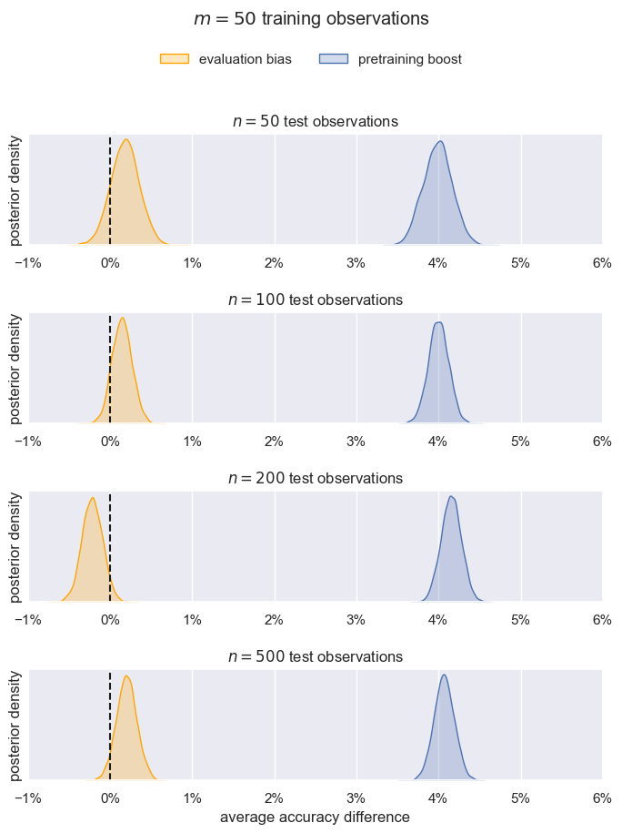
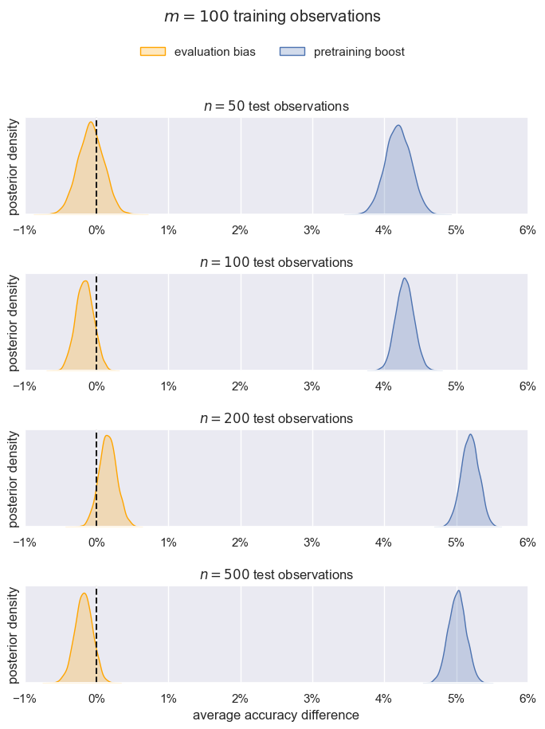

# Summarize all the data into tables and curves

<details>
<summary>Tables</summary>

```bash
python summary.py
```

Note: The SE is calculated *after* averaging subsamples, because these are technical
replicates. So the divisor is the just the square root of the number of datasets.

```
-------------------------------------------------------------------------------------

m (# training observations) = 50

extra - base (pretraining boost)
┌─────────────────────────┬─────────┬──────────┬──────────┐
│ n (# test observations) ┆ lm_type ┆ mean     ┆ se       │
│ ---                     ┆ ---     ┆ ---      ┆ ---      │
│ i32                     ┆ str     ┆ f64      ┆ f64      │
╞═════════════════════════╪═════════╪══════════╪══════════╡
│ 50                      ┆ bert    ┆ 0.041272 ┆ 0.009548 │
│ 50                      ┆ gpt2    ┆ 0.03832  ┆ 0.011693 │
│ 100                     ┆ bert    ┆ 0.03886  ┆ 0.010742 │
│ 100                     ┆ gpt2    ┆ 0.04094  ┆ 0.011703 │
│ 200                     ┆ bert    ┆ 0.03902  ┆ 0.011268 │
│ 200                     ┆ gpt2    ┆ 0.043924 ┆ 0.011899 │
│ 500                     ┆ bert    ┆ 0.035112 ┆ 0.012875 │
│ 500                     ┆ gpt2    ┆ 0.046108 ┆ 0.010583 │
└─────────────────────────┴─────────┴──────────┴──────────┘

test - extra (evaluation bias)
┌─────────────────────────┬─────────┬───────────┬──────────┐
│ n (# test observations) ┆ lm_type ┆ mean      ┆ se       │
│ ---                     ┆ ---     ┆ ---       ┆ ---      │
│ i32                     ┆ str     ┆ f64       ┆ f64      │
╞═════════════════════════╪═════════╪═══════════╪══════════╡
│ 50                      ┆ bert    ┆ 0.001848  ┆ 0.002222 │
│ 50                      ┆ gpt2    ┆ 0.001832  ┆ 0.00101  │
│ 100                     ┆ bert    ┆ 0.001776  ┆ 0.001403 │
│ 100                     ┆ gpt2    ┆ 0.001096  ┆ 0.000761 │
│ 200                     ┆ bert    ┆ -0.003848 ┆ 0.00316  │
│ 200                     ┆ gpt2    ┆ -0.00046  ┆ 0.000953 │
│ 500                     ┆ bert    ┆ 0.004764  ┆ 0.005196 │
│ 500                     ┆ gpt2    ┆ -0.000764 ┆ 0.001356 │
└─────────────────────────┴─────────┴───────────┴──────────┘

-------------------------------------------------------------------------------------

m (# training observations) = 100

extra - base (pretraining boost)
┌─────────────────────────┬─────────┬──────────┬──────────┐
│ n (# test observations) ┆ lm_type ┆ mean     ┆ se       │
│ ---                     ┆ ---     ┆ ---      ┆ ---      │
│ i32                     ┆ str     ┆ f64      ┆ f64      │
╞═════════════════════════╪═════════╪══════════╪══════════╡
│ 50                      ┆ bert    ┆ 0.062064 ┆ 0.014933 │
│ 50                      ┆ gpt2    ┆ 0.021512 ┆ 0.011808 │
│ 100                     ┆ bert    ┆ 0.060996 ┆ 0.014185 │
│ 100                     ┆ gpt2    ┆ 0.024632 ┆ 0.011768 │
│ 200                     ┆ bert    ┆ 0.040692 ┆ 0.016094 │
│ 200                     ┆ gpt2    ┆ 0.062892 ┆ 0.01802  │
│ 500                     ┆ bert    ┆ 0.061296 ┆ 0.014497 │
│ 500                     ┆ gpt2    ┆ 0.038868 ┆ 0.013642 │
└─────────────────────────┴─────────┴──────────┴──────────┘

test - extra (evaluation bias)
┌─────────────────────────┬─────────┬───────────┬──────────┐
│ n (# test observations) ┆ lm_type ┆ mean      ┆ se       │
│ ---                     ┆ ---     ┆ ---       ┆ ---      │
│ i32                     ┆ str     ┆ f64       ┆ f64      │
╞═════════════════════════╪═════════╪═══════════╪══════════╡
│ 50                      ┆ bert    ┆ -0.000752 ┆ 0.001358 │
│ 50                      ┆ gpt2    ┆ -0.000512 ┆ 0.000963 │
│ 100                     ┆ bert    ┆ -0.003712 ┆ 0.002228 │
│ 100                     ┆ gpt2    ┆ 0.000268  ┆ 0.000668 │
│ 200                     ┆ bert    ┆ 0.003264  ┆ 0.002765 │
│ 200                     ┆ gpt2    ┆ -0.000112 ┆ 0.001128 │
│ 500                     ┆ bert    ┆ -0.001592 ┆ 0.004482 │
│ 500                     ┆ gpt2    ┆ -0.002076 ┆ 0.000832 │
└─────────────────────────┴─────────┴───────────┴──────────┘
```

</details>


<details>
<summary>Curves</summary>

Curves produced by [`./posterior_pred.ipynb`](./posterior_pred.ipynb)

<details>
<summary>m = 50</summary>



</details>


<details>
<summary>m = 100</summary>



</details>

</details>


<details>
<summary>Conclusion</summary>

We've sanity checked that pretraining is clearly beneficial across $n$. The boost in
accuracy is practically significant. There is potentially an effect to detect.

There evaluation bias is not. It bounces around 0. But even the big bounces aren't
enough to make a difference on most leaderboards / in most practical settings.

</details>
