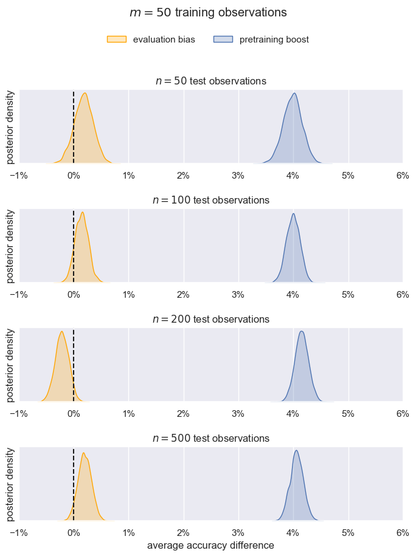
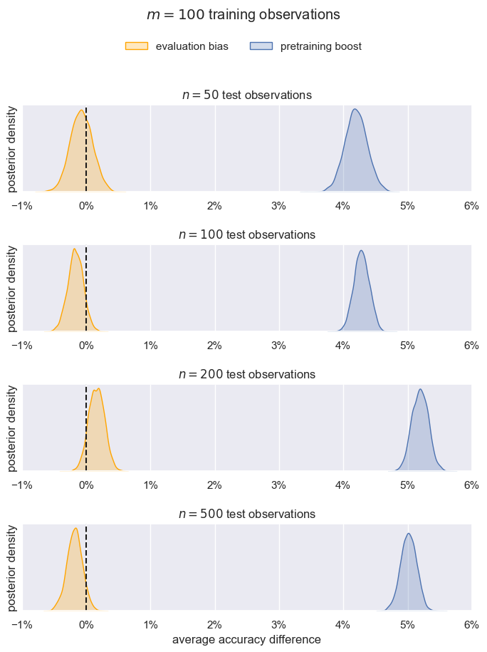

# Summarize all the data into tables and curves

<details>
<summary>Tables</summary>

```bash
python summary.py
```

```
-------------------------------------------------------------------------------------

m (# training observations) = 100

extra - base (pretraining boost)
┌─────────────────────────┬─────────┬──────────┬──────────┐
│ n (# test observations) ┆ lm_type ┆ mean     ┆ se       │
│ ---                     ┆ ---     ┆ ---      ┆ ---      │
│ i32                     ┆ str     ┆ f64      ┆ f64      │
╞═════════════════════════╪═════════╪══════════╪══════════╡
│ 50                      ┆ bert    ┆ 0.062064 ┆ 0.007801 │
│ 50                      ┆ gpt2    ┆ 0.021512 ┆ 0.00647  │
│ 100                     ┆ bert    ┆ 0.060996 ┆ 0.007051 │
│ 100                     ┆ gpt2    ┆ 0.024632 ┆ 0.005623 │
│ 200                     ┆ bert    ┆ 0.040692 ┆ 0.007439 │
│ 200                     ┆ gpt2    ┆ 0.062892 ┆ 0.006661 │
│ 500                     ┆ bert    ┆ 0.061296 ┆ 0.00662  │
│ 500                     ┆ gpt2    ┆ 0.038868 ┆ 0.005375 │
└─────────────────────────┴─────────┴──────────┴──────────┘

test - extra (evaluation bias)
┌─────────────────────────┬─────────┬───────────┬──────────┐
│ n (# test observations) ┆ lm_type ┆ mean      ┆ se       │
│ ---                     ┆ ---     ┆ ---       ┆ ---      │
│ i32                     ┆ str     ┆ f64       ┆ f64      │
╞═════════════════════════╪═════════╪═══════════╪══════════╡
│ 50                      ┆ bert    ┆ -0.000752 ┆ 0.006085 │
│ 50                      ┆ gpt2    ┆ -0.000512 ┆ 0.002824 │
│ 100                     ┆ bert    ┆ -0.003712 ┆ 0.005826 │
│ 100                     ┆ gpt2    ┆ 0.000268  ┆ 0.002123 │
│ 200                     ┆ bert    ┆ 0.003264  ┆ 0.006085 │
│ 200                     ┆ gpt2    ┆ -0.000112 ┆ 0.001992 │
│ 500                     ┆ bert    ┆ -0.001592 ┆ 0.005723 │
│ 500                     ┆ gpt2    ┆ -0.002076 ┆ 0.002078 │
└─────────────────────────┴─────────┴───────────┴──────────┘

-------------------------------------------------------------------------------------

m (# training observations) = 50

extra - base (pretraining boost)
┌─────────────────────────┬─────────┬──────────┬──────────┐
│ n (# test observations) ┆ lm_type ┆ mean     ┆ se       │
│ ---                     ┆ ---     ┆ ---      ┆ ---      │
│ i32                     ┆ str     ┆ f64      ┆ f64      │
╞═════════════════════════╪═════════╪══════════╪══════════╡
│ 50                      ┆ bert    ┆ 0.041272 ┆ 0.007566 │
│ 50                      ┆ gpt2    ┆ 0.03832  ┆ 0.006753 │
│ 100                     ┆ bert    ┆ 0.03886  ┆ 0.007041 │
│ 100                     ┆ gpt2    ┆ 0.04094  ┆ 0.005886 │
│ 200                     ┆ bert    ┆ 0.03902  ┆ 0.006867 │
│ 200                     ┆ gpt2    ┆ 0.043924 ┆ 0.005357 │
│ 500                     ┆ bert    ┆ 0.035112 ┆ 0.00682  │
│ 500                     ┆ gpt2    ┆ 0.046108 ┆ 0.004582 │
└─────────────────────────┴─────────┴──────────┴──────────┘

test - extra (evaluation bias)
┌─────────────────────────┬─────────┬───────────┬──────────┐
│ n (# test observations) ┆ lm_type ┆ mean      ┆ se       │
│ ---                     ┆ ---     ┆ ---       ┆ ---      │
│ i32                     ┆ str     ┆ f64       ┆ f64      │
╞═════════════════════════╪═════════╪═══════════╪══════════╡
│ 50                      ┆ bert    ┆ 0.001848  ┆ 0.007104 │
│ 50                      ┆ gpt2    ┆ 0.001832  ┆ 0.00271  │
│ 100                     ┆ bert    ┆ 0.001776  ┆ 0.006541 │
│ 100                     ┆ gpt2    ┆ 0.001096  ┆ 0.00229  │
│ 200                     ┆ bert    ┆ -0.003848 ┆ 0.006511 │
│ 200                     ┆ gpt2    ┆ -0.00046  ┆ 0.001908 │
│ 500                     ┆ bert    ┆ 0.004764  ┆ 0.005999 │
│ 500                     ┆ gpt2    ┆ -0.000764 ┆ 0.001714 │
└─────────────────────────┴─────────┴───────────┴──────────┘
```

</details>


<details>
<summary>Curves</summary>

Distributions of marginal effects. These plots are much easier to interpret than ones
about $\beta$. In other words, the distributions of $\frac{\bar{\hat{Y}}_{\cdot \cdot
\cdot 1} - \bar{\hat{Y}}_{\cdot \cdot \cdot 0}}{n}$, i.e., the difference between the
treatment ($1$) and control ($0$) grand means. The mean is taken across LM types,
classification tasks, and their subsamples. We could produce conditional plots for each
of these groups, but rn I want to summarize the results.

**Required data**: posterior samples are stored in `main_*.nc` files. Obtain them by
running the notebooks in [`../fit_posteriors/`](../fit_posteriors/). Unfortunately all
of the inference data was saved (including for parameters we don't care about), so these
files are in the 10s of GBs. I'm trying to find a cheap and long-term way to share
these. Sorry.


<details>
<summary>m = 50</summary>



</details>


<details>
<summary>m = 100</summary>



</details>

</details>


<details>
<summary>Conclusion</summary>

We've sanity checked that pretraining is clearly beneficial across $n$. The boost in
accuracy is practically significant. There is potentially an effect to detect.

There evaluation bias is not. It bounces around 0. But even the big bounces aren't
enough to make a difference on most leaderboards / in most practical settings.

</details>
